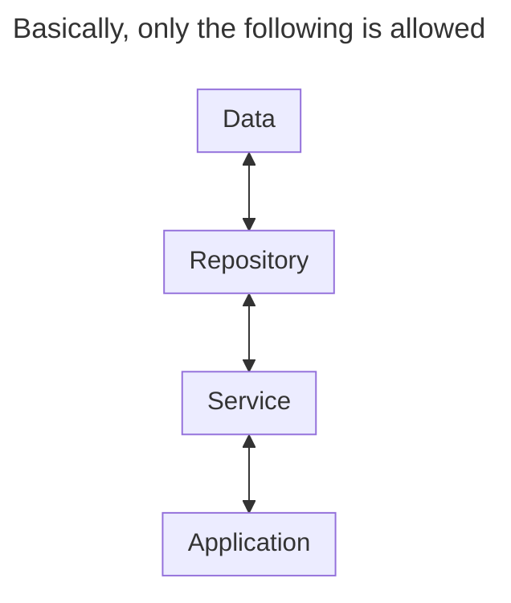

## What is Dependency Injection?

Dependency injection is a programming technique used to decouple a class or a function from their dependencies by passing them as arguments.

Consider the following example:

```python
class UserManager:
    def __init__(self):
        self.data = {}

    def create_user(self, username):
        user_data = {
            "username": username,
            "password": random_password,
            "created_at": datetime.now()
        }
        self.data[username] = user_data
```

In this example, the UserManager class creates a data dictionary and stores it in the `data` attribute. The `create_user` method then uses the `data` attribute to create a user. This locks the UserManager class into a stateful approach and makes it difficult to change the implementation of the UserManager class in the future, especially while creating unit tests.

So, how do we improve on this using dependency injection?

## The Repository-Service Pattern

The repository-service pattern is a design pattern that allows for the separation of the data access layer from the business logic layer.

The repository-service pattern commonly consists of the following main components:

- A data model
- A repository interface
- A repository implementation
- A service to interact with the repository

Let's take a look at how we would prepare this code for the repository-service pattern.

### Data Model

The data model consists of a class that represents the data the repository will be storing in the format that the project requires. The data model is a very simple concept that should keep logic to a minimum. Possible logic could be data validation, data sanitization, etc.

> Note: You can use `TypedDict`, `dataclasses` or `pydantic` to aid in the creation of these classes. `pydantic` will provide the validation and sanitization logic for you 😀.
{: .prompt-info }

```python
class User:
    def __init__(self, username, password, created_at):
        assert isinstance(username, str)
        assert isinstance(password, str)

        self.username = username
        self.password = password
        self.created_at = created_at
```

### Repository Interface

The repository interface is a contract that the repository implementation must adhere to. It defines the methods that the repository implementation must implement. The addition of this layer of abstraction makes it easy to (inter)change the implementation of the repository.

The repository interface should only provide basic CRUD operations. We will get to additional functionality later.

```python
from abc import ABC, abstractmethod

class BaseUserRepository(ABC):
    @abstractmethod
    def get_one(self, username):
        ...

    @abstractmethod
    def get_many(self, usernames):
        ...

    @abstractmethod
    def create(self, username, password):
        ...

    @abstractmethod
    def update(self, username, password):
        ...

    @abstractmethod
    def delete(self, username):
        ...
```

### Repository Implementation

The repository implementation inherits from the interface and implements the methods defined in the interface. Its main responsibility is to abstract the database layer away from the rest of the application. The repository will return and receive plain data.

```python
class UserRepository(BaseUserRepository):
    def __init__(self):
        self.data: dict[str, dict] = {}

    def get_one(self, username):
        return self.data.get(username)

    def get_many(self, usernames):
        return [self.data[username] for username in usernames if username in self.data]

    def create(self, username, password):
        self.data[username] = {
            "username": username,
            "password": password,
            "created_at": datetime.now()
        }

    def update(self, username, password):
        self.data[username]["password"] = password

    def delete(self, username):
        del self.data[username]
```

### Service

The service is the layer that interacts with the repository and provides models to the application. Any logic that is not part of the repository should be handled by the service layer.

```python
class UserService:
    def __init__(self, repository: BaseUserRepository):
        self.repository = repository

    def get_one(self, username):
        data = self.repository.get_one(username)
        return User(**data)

    def get_many(self, usernames):
        data = self.repository.get_many(usernames)
        return [User(**user) for user in data]

    def create(self, username, password):
        self.repository.create(username, password)

    def update(self, username, password):
        self.repository.update(username, password)

    def delete(self, username):
        self.repository.delete(username)

    def exists(self, username):
        return get_one(username) is not None
```

This layer is where dependency injection comes into play.

In this example, the user repository uses a stateful approach by storing the data in a dictionary. In a real application, the user repository would be interacting with a database of sorts.

This makes it difficult to unit test the repository as we normally would need to mock the database. However, because of dependency injection, we can easily change the implementation of the user repository inside the tests and test the service layer without acquiring the database.

### Rules

Now, you might be excited to use this pattern in everything you write. However, there are some rules to follow to make sure shit doesn't hit the fan. In principle, this means that you may only interact one layer deep.

- The application may only interact with the service layer.
- The service layer may only interact with the repository layer.
- The service layer may interact with multiple repositories.
- A service is allowed to call its own methods, but not other services.
- The repository layer may only interact with the data layer.



### Using our example

In our example, we are injecting the repository into the service via its constructor.

```python
repository = UserRepository()
service = UserService(repository)

# Create a user
service.create("username", "password")
```

## Conclusion

Dependency injection is a very powerful technique that modern programmers should be familiar with. The repository-service pattern is a great use case for it, and I hope that this post has made you want to try this out for yourself, unless you are already using it.

I have also implemented dependency injection in my osu! API library, which implements a base repository for storing OAuth tokens. If you wish to see that as well, you may check it out [here](https://github.com/NiceAesth/aiosu/blob/master/examples/v2/custom_repository.py).
